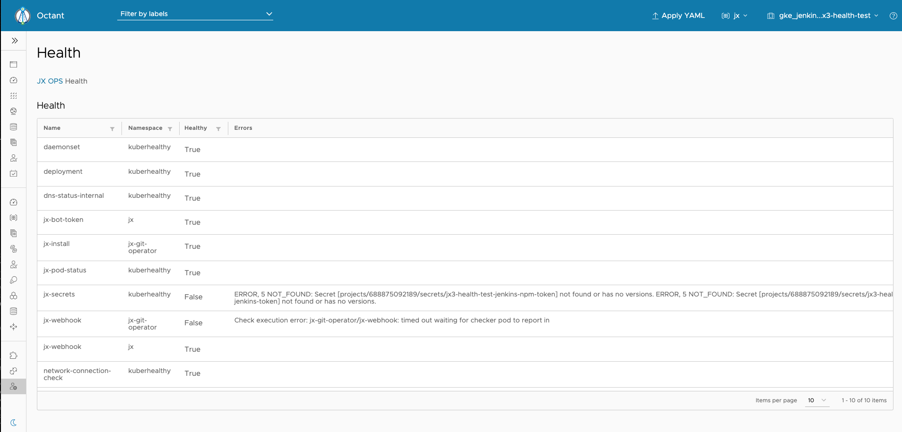

# jx-health

[](https://pkg.go.dev/mod/github.com/jenkins-x-plugins/jx-health)
[](https://goreportcard.com/report/github.com/jenkins-x-plugins/jx-health?dummy=unused)
[](https://github.com/jenkins-x-plugins/jx-health/releases)
[](https://github.com/jenkins-x-plugins/jx-health/blob/master/LICENSE)
[](https://slack.k8s.io/)

jx-health is a small command line tool working with health statuses from [Kuberhealthy](https://github.com/Comcast/kuberhealthy)

Using Kuberhealthy and custom checks we are able to report the health of a Kubernetes cluster by only reading the Kuberhealthy state custom resources.  This is good for user RBAC restricted environments as the Kuebrhealthy checks run with a Kubernetes service account to validate things like secrets, without revealing any sensitive data and report errors when a user may not have access.

jx-health is not tied to Jenkins X, it can be installed and used standalone though using Jenkins X 3.x (alpha) makes it easier to get started.

## RBAC requirements
The required RBAC needed for users of this command:

| Resource | Role | Namespace | Reason |
| -------- | ---- | --------- | ------ |
| Deployments | Get | kuberhealthy | used to verify Kuberhealthy is running |
| khstates.v1.comcast.github.io | List | kuberhealthy | used to return the status of default Kuberhealthy checks |
| khstates.v1.comcast.github.io | Watch | kuberhealthy | used to watch the status of default Kuberhealthy checks |
| khstates.v1.comcast.github.io | List | * | used to return the status of Jenkins X and custom Kuberhealthy checks in all namespaces |
| khstates.v1.comcast.github.io | Watch | * | used to watch the status of Jenkins X and custom Kuberhealthy checks in all namespaces |

## Commands

See the [jx-health command reference](docs/cmd/jx-health.md#see-also)

## Getting Started

There are three parts to using this health plugin:
1. `jx-health` client side CLI used to query health checks
2. Kuberhealthy server side controller used to start checks and capture results
3. custom server side health checks

### Get the CLI

Download the [jx-health binary](https://github.com/jenkins-x-plugins/jx-health/releases) for your operating system and add it to your `$PATH`.


### Install serverside helm charts

Choose one of the options below:

#### Using vanilla Helm
```
helm repo add kuberhealthy https://comcast.github.io/kuberhealthy/helm-repos
helm install kuberhealthy kuberhealthy/kuberhealthy -n kuberhealthy --set check.daemonset.enabled=true --set check.deployment.enabled=true --set check.dnsInternal.enabled=true --set check.networkConnection.enabled=true
```
optionally install the Jenkins X 3.x custom health checks
```
helm repo add jx3 https://storage.googleapis.com/jenkinsxio/charts
helm install cluster-checks jx3/jx-kh-check -n kuberhealthy --set jxPodStatus.enabled=true --set jxPodStatus.cluster.enabled=true --set jxSecrets.enabled=true --set jxSecrets.cluster.enabled=true  
helm install health-checks-jx jx3/jx-kh-check -n jx --set jxWebhooks.enabled=true --set jxBotToken.enabled=true
helm install health-checks-install jx3/jx-kh-check -n jx-git-operator --set jxInstall.enabled=true
``` 
```
jx-health get status --all-namespaces --watch
```

#### Using Jenkins X 3.x (alpha)
If using Jenkins X 3 alpha then you get the benefits of a top level CLI to manage upgrades and GitOps for you cluster.

Get the plugin by running
```
jx upgrade cli
jx upgrade plugins
```
You will also need to upgrade your clusters version stream which updates the cluster to the latest release
```
jx gitops upgrade
```
git commit / push then check the git operator job is successful
```
jx admin logs
```
Then to add the new server side checks (kuberhealthy ) again from a cloned copy of your cluster git repo, run

```
jx gitops helmfile add --chart kuberhealthy/kuberhealthy
jx gitops helmfile add --chart jx3/jx-kh-check
jx gitops helmfile add --chart jx3/jx-kh-check --name health-checks-jx
jx gitops helmfile add --chart jx3/jx-kh-check --name health-checks-install
``` 
review the local changes, you should see four new charts added to your helmfile.yaml git commit / push then check the git operator job is successful
```
jx admin logs
```

get the check statuses

```
jx health get status --all-namespaces --watch
```
[](https://asciinema.org/a/NIVl2oIzWNlz1cZ9GhJ2y7qA7?autoplay=1)

or using the [Jenkins X Octant plugin](https://github.com/jenkins-x/octant-jx)



## Developing

Golang 1.15

If you get this error when building:
```
# github.com/jenkins-x-plugins/jx-health/pkg/health/lookup
pkg/health/lookup/lookup.go:19:20: undefined: Asset
make: *** [build] Error 2
```
You need to run:
```
go get -u github.com/go-bindata/go-bindata/...
```
and
```
make bind
```
You can now build this repository using your local modifications and try the locally built binary in `build/jx-health` or run the unit tests via `make test`